[![SWUbanner]][SWUdocs]

[SWUbanner]:
https://raw.githubusercontent.com/vshymanskyy/StandWithUkraine/main/banner-personal-page.svg
[SWUdocs]:
https://github.com/vshymanskyy/StandWithUkraine/blob/main/docs/README.md

## Stats

Totally:  &nbsp; | &nbsp; Last year:

## Maintainer

[pre-commit-config](http://tinyurl.com/pre-commit-config) gist inculudes most useful pre-commit's for each stack

 
 

### Maintainer previously

Owner of Ukrainian localization team. Localization progress [tracks here](https://github.com/kubernetes-i18n-ukrainian/website)

 

